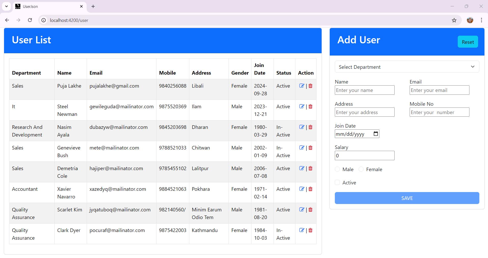

# UserJson

This project was generated with [Angular CLI](https://github.com/angular/angular-cli) version 17.3.5.

# Features

- Create: Add new user to the database.
- Read: Retrieve and display list of users.
- Update: Modify existing users in the database.
- Delete: Remove user from the database.

## Development server

Run `ng serve` for a dev server. Navigate to `http://localhost:4200/`. The application will automatically reload if you change any of the source files.

## Technologies Used

- Angular: Framework for building the front end.
- JSON Server: Simple and fast way to create a mock REST API.
- HTML/SASS: For structure and styling of the application.

## Packages Used

This project utilizes several npm packages to enhance its functionality:

1. @angular/core: The core library for building Angular applications. It provides the main features of Angular, such as components and services.

2. @angular/common: Contains common directives, pipes, and services used in Angular applications, including functionality for HTTP requests and localization.

3. @angular/forms: Facilitates user input handling and form validation. It supports both template-driven and reactive forms.

4. @angular/router:Manages navigation and routing within the application, allowing for easy transitions between different views and components.

5. json-server: A simple tool to set up a RESTful API with minimal configuration for mock data. It can quickly provide a full CRUD interface using a JSON file as a database.

6. ngx-toastr: A library for displaying non-blocking notifications in Angular applications, providing customizable toast messages for success, error, and informational alerts.

7. npm-bootstrap: A package that allows easy integration of Bootstrap CSS and JS into your Angular application, enabling responsive design and modern UI components.

## Installation

These packages are included in the package.json file. You can install them using npm:
**npm install**

## Start JSON Server

    json-server --watch db.json

## Run the Angular application

    ng serve

## Code scaffolding

Run `ng generate component component-name` to generate a new component. You can also use `ng generate directive|pipe|service|class|guard|interface|enum|module`.

## Build

Run `ng build` to build the project. The build artifacts will be stored in the `dist/` directory.

## User Interface

## Running unit tests

Run `ng test` to execute the unit tests via [Karma](https://karma-runner.github.io).

## Running end-to-end tests

Run `ng e2e` to execute the end-to-end tests via a platform of your choice. To use this command, you need to first add a package that implements end-to-end testing capabilities.

## Further help

To get more help on the Angular CLI use `ng help` or go check out the [Angular CLI Overview and Command Reference](https://angular.io/cli) page.
